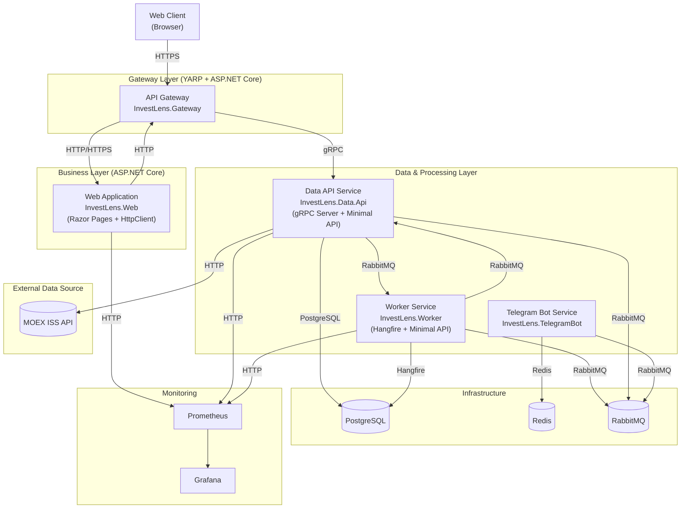

# InvestLens | .NET 9 • Docker • PostgreSQL • gRPC • RabbitMQ

**Название проекта:** InvestLens

**Описание:**

InvestLens — это полнофункциональная платформа для мониторинга и аналитики инвестиционных портфелей, построенная на **микросервисной архитектуре** с использованием современных практик разработки и DevOps.

**Ключевые особенности системы:**

*   **Полноценная микросервисная архитектура** — 6 независимых сервисов, каждый со своей зоной ответственности
*   **Многоуровневое взаимодействие** — комбинация синхронного (gRPC) и асинхронного (RabbitMQ) взаимодействия
*   **Производственный мониторинг** — полный стек видимости работы системы с метриками, логами и трассировкой
*   **Отказоустойчивость** — политики Retry и Circuit Breaker для всех внешних вызовов
*   **Контейнеризация** — полная изоляция и простота развертывания через Docker Compose
*   **Фоновые задачи** — управляемый планировщик с веб-интерфейсом
*   **Уведомления** — Telegram-бот для мониторинга состояния системы

## 🛠️ **Технологический стек**

### **Backend & Фреймворки**
- **.NET 9.0** (ASP.NET Core, Minimal API)
- **Entity Framework Core 9.0** (Code-First подход)
- **Npgsql 9.0** (PostgreSQL провайдер)
- **Dapper** для высокопроизводительных операций с данными

### **Взаимодействие сервисов**
- **gRPC** (Google.Protobuf, Grpc.AspNetCore) — межсервисная коммуникация
- **RabbitMQ** — брокер сообщений для асинхронных операций
- **YARP (Yet Another Reverse Proxy)** — API Gateway

### **Фоновые задачи & Планировщик**
- **Hangfire** — надежный планировщик фоновых задач с PostgreSQL storage
- **Hangfire Dashboard** для мониторинга и управления задачами

### **Базы данных & Кэширование**
- **PostgreSQL 15** — основное хранилище данных
- **Redis 7** — кэширование и хранение состояния
- **StackExchange.Redis** — клиент для Redis

### **Логирование & Мониторинг**
- **Serilog** — структурированное логирование
- **Prometheus + Grafana** — сбор и визуализация метрик
- **prometheus-net** — интеграция метрик в ASP.NET Core
- **CorrelationId** — сквозная идентификация запросов
- **Health Checks** — мониторинг здоровья сервисов (PostgreSQL, Redis, RabbitMQ, Hangfire)

### **Внешние API & Интеграции**
- **Telegram.Bot** — интеграция с Telegram API
- **MOEX ISS API** — источник финансовых данных
- **AutoMapper** — маппинг объектов

### **Resilience & Паттерны**
- **Polly** — политики устойчивости (Retry, Circuit Breaker)
- **CorrelationId** для распределенной трассировки
- **Централизованная конфигурация** через `.env` файлы

### **Frontend (Web Application)**
- **ASP.NET Core Razor Pages** — серверный рендеринг
- **Bootstrap 5** — UI компоненты
- **Font Awesome** — иконки
- **Клиентская пагинация и сортировка**

### **DevOps & Инфраструктура**
- **Docker & Docker Compose** — контейнеризация
- **PostgreSQL**, **Redis**, **RabbitMQ** как сервисы
- **Прометей + Grafana** для мониторинга
- **Централизованное управление пакетами**

## 🏗️ **Архитектура системы**

### **Микросервисная архитектура**


### **Ключевые архитектурные решения:**

1. **Central Package Management (CPM)** — централизованное управление версиями NuGet пакетов через `Directory.Packages.props` для обеспечения согласованности зависимостей между всеми 6 микросервисами
2. **Контейнеризация (Docker Compose)** — весь стек разворачивается через Docker, включая инфраструктурные сервисы.
3. **API Gateway (YARP)** — единая точка входа, маршрутизация и CORS.
4. **Асинхронная коммуникация**:
   - **gRPC** для высокопроизводительной синхронной связи между сервисами
   - **RabbitMQ** для асинхронной обработки фоновых задач и событий
5. **Фоновые задачи (Hangfire)** — планировщик с Web Dashboard для управления джобами.
6. **Telegram Bot** — отдельный сервис для уведомлений и мониторинга.
7. **Полный мониторинг**:
   - **Prometheus** для сбора метрик
   - **Grafana** для визуализации
   - **Health Checks** с UI для всех сервисов
   - **Correlation ID** для сквозной трассировки запросов

## 🎯 **Ключевые технические достижения**

1.  **Сложная обработка данных** — конвейерная загрузка данных из MOEX с пагинацией, буферизацией и batch-сохранением
2.  **Гибкий планировщик** — конфигурируемые задачи Hangfire с веб-интерфейсом управления
3.  **Полноценная трассировка** — сквозной Correlation ID через все сервисы
4.  **Production-мониторинг** — метрики Prometheus для каждого сервиса
5.  **Резилентность** — политики Polly для всех внешних зависимостей
6.  **Современный .NET** — использование последних версий .NET 9 и Entity Framework Core 9

## 🚀 **Запуск проекта**

```bash
# 1. Клонировать репозиторий
git clone https://github.com/Alexander-Yurtaev/InvestLens.git
cd investlens

# 2. Настроить переменные окружения
cp .env.example .env
cp .\src\InvestLens.Data\InvestLens.Data.Api\.env.example .\src\InvestLens.Data\InvestLens.Data.Api\.env
cp .\src\InvestLens.TelegramBot\.env.example .\src\InvestLens.TelegramBot\.env
cp .\src\InvestLens.Web\.env.example .\src\InvestLens.Web\.env
cp .\src\InvestLens.Worker\.env.example .\src\InvestLens.Worker\.env

# Отредактировать .env файл-ы

# 3. Создать сертификаты для https-соединений
mkdr C:\docker-certs\invest-lens
run .\scripts\generate-certificates.bat

# 3. Запустить все сервисы
docker-compose up -d

# 4. Доступные эндпоинты:
#    • Web UI:              https://localhost:8081
#    • Hangfire Dashboard:  https://localhost:5021/jobs
#    • Health Checks:       https://localhost:8081/health-ui
#    • Grafana:             http://localhost:3000 (admin/admin)
#    • Prometheus:          http://localhost:9090
#    • RabbitMQ:            http://localhost:15672
```

---

Проект представляет собой отличный пример full-stack .NET решения, демонстрирующий как современные архитектурные паттерны, так и внимание к production-аспектам разработки.

<p align="center">
  
</p>
