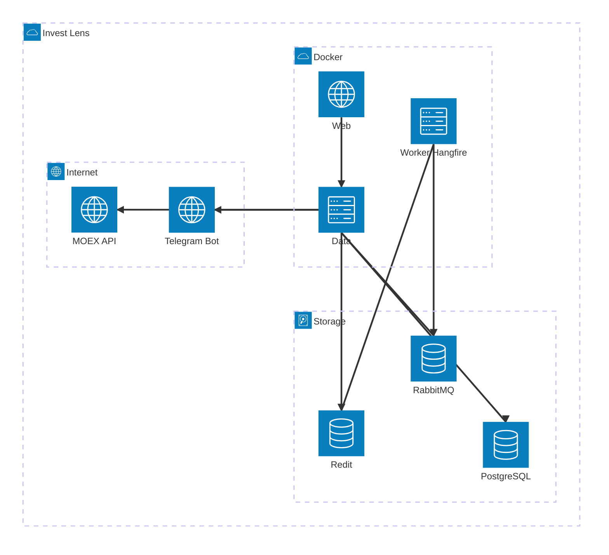

```mermaid
architecture-beta
    group sln(cloud)[Invest Lens]
   
    group docker(cloud)[Docker] in sln
    group storage(disk)[Storage] in sln
    group internet(internet)[Internet] in sln

    service data(server)[Data] in docker
    service worker(server)[Worker Hangfire] in docker
    service web(internet)[Web] in docker

    service postgres(database)[PostgreSQL] in storage
    service rabbitmq(database)[RabbitMQ] in storage
    service redis(database)[Redit] in storage
    
    service bot(internet)[Telegram Bot] in internet
    service moex(internet)[MOEX API] in internet

    web:B --> T:data
    data:L --> R:moex
    data:B --> T:postgres
    data:L --> R:bot

    worker:B --> T:redis
    worker:B --> T:rabbitmq
    data:B --> T:rabbitmq
    data:B --> T:redis
```